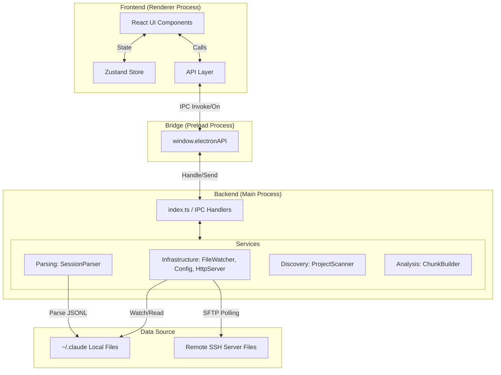
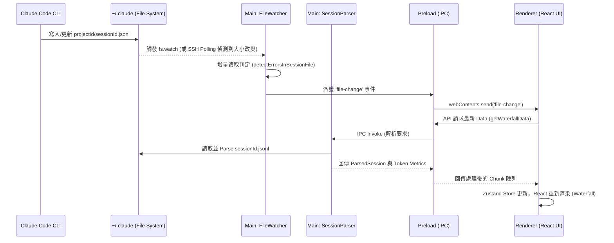
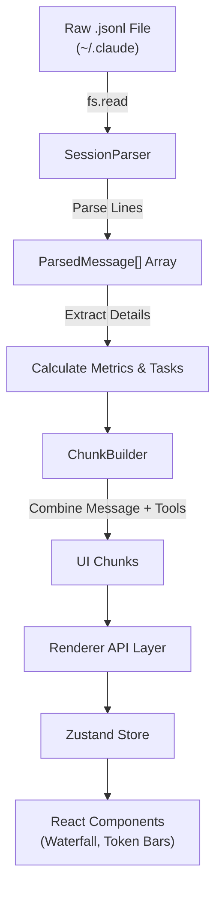
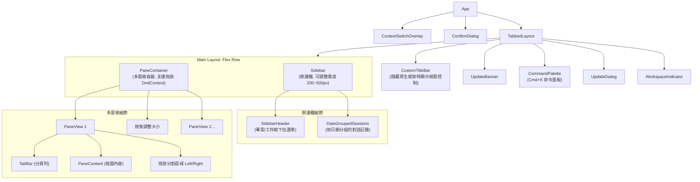

# Claude Devtools 詳細專案架構與模組說明文件

這份文件提供了 `claude-devtools` 在 `src/` 目錄下的所有 Process 與 Module 的深度剖析。內容包含整個應用程式的處理架構圖、資料流程圖、與 `~/.claude` 的時序圖，以及前端 UI 與後端邏輯的具體對應關係。

---

## 1. 系統整體架構 (System Architecture)

`claude-devtools` 採用標準的 Electron 三層進程架構 (Main, Preload, Renderer)，並且額外提供了一個 `Standalone` (獨立 HTTP 伺服器) 模式供 Docker 或遠端部署使用。所有進程間共享 `Shared` 模組的型別與常數。



---

## 2. 各 Process 與 Module 詳細說明

### 2.1 主進程 (Main Process) - `src/main/`

主進程是 Node.js 執行環境，擁有最高權限，負責所有作業系統層級的操作、檔案讀寫、伺服器啟動與資料處理。

#### Main 核心 Module 與職責

1. **`services/infrastructure/` (基礎設施)**
    * **`FileWatcher.ts`**: 監聽 `~/.claude/projects/` 與 `~/.claude/todos/` 目錄。當有 `.jsonl` 或 `.json` 異動時，會執行增量解析並派發 `file-change` 事件。同時若啟用 SSH 模式，會轉換為 Polling (輪詢) 機制而非 `fs.watch`。
    * **`ServiceContext.ts`**: 封裝了當前運行環境的服務實體（例如區分「本地上下文」與「SSH 連線上下文」），每個上下文擁有自己獨立的 Scanner, Parser, Watcher。
    * **`HttpServer.ts`**: 供 Standalone 模式使用的 Fastify 伺服器，利用 Server-Sent Events (SSE) 替代 IPC 進行前端推播。
    * **`NotificationManager.ts`**: 集中管理通知邏輯，例如偵測到 Claude Code 存取 `.env` 檔案或消耗超過指定的 Token 時發出系統通知。

2. **`services/parsing/` (解析器)**
    * **職責**: 負責深入讀取特定歷史對話檔，將其從原始的 JSONL 格式轉換成具備強型別結構的內部領域物件 (Domain Objects)。
    * **輸入的檔案**:
        * 主對話檔：`~/.claude/projects/<id>/<sessionId>.jsonl`
        * 子代理檔：`~/.claude/projects/<id>/<sessionId>/subagents/agent-<hash>.jsonl`
    * **處理產生的實體/事件 (Outputs)**:
        * `ParsedMessage`: 強型別的對話建構區塊，包含了完整的對話內容、圖文陣列結構。
        * `ToolCall` / `ToolResult`: 從原始訊息的 `<tool_use>` 以及底層結構中抽取出來，如 `Bash`、`Read`、甚至建立 Subagent 的 `Task`。
        * `SessionMetrics`: 統計所有的 Token 使用量（Input, Output, Cache Read, Cache Creation）、以及對話執行時長與花費。
        * **噪音過濾**: 解析過程會自動辨識出 `hardNoise` (如沒用的 metadata tag)、`isSidechain` 訊息，確保後端傳給前方的資料是乾淨可用的內容。

3. **`services/discovery/` (探索器)**
    * **職責**: 負責高效率掃描本機或遠端目錄，偵測所有可用專案與最近的對話狀態，提供快速的導航結構，不會深度讀取每個檔案的完整內容。
    * **處理的檔案目錄**:
        * 專案目錄清單：掃描 `~/.claude/projects/` 這個根目錄。
        * 檔案屬性 (stat)：讀取各專屬目錄下 `.jsonl` 檔案的最新修改時間 (mtime) 與大小，但不執行逐行完整解析。
        * 任務清單檔案：讀取 `~/.claude/todos/<sessionId>.json`。
    * **處理產生的實體/事件 (Outputs)**:
        * `Project`：解碼 Base64 編碼的資料夾名稱，還原為實際的本機路徑與專案名稱。
        * `RepositoryGroup` & `Worktree`：透過 `WorktreeGrouper` 分析不同的專案目錄，將屬於同一個 Git Repository 的不同 Worktree 合併歸類在一起。
        * `Session` (Light Metadata)：從檔案屬性產生初步的 Session 摘要（僅包含 ID, 產生時間, Message Count, 第一句話等預覽用數據），傳遞給 Sidebar 用作分頁 (Paginated) 列表顯示。

4. **`services/analysis/` (分析器)**
    * **職責**: 作為 UI 的轉換器層 (Presenter Layer)。它不直接讀取硬碟上的實體檔案，而是接收由 Parsing 模組解析出來的記憶體資料，並將其處理成能夠直接綁定在 React 元件上的高階視覺化結構。
    * **輸入資料**:
        * 經由 `SessionParser` 解析出來的 `ParsedMessage[]` 與衍生工具數據。
    * **處理產生的實體/事件 (Outputs)**:
        * `Chunk`：將散落的訊息封裝成有意義的獨立區塊，例如：
            * `UserChunk`: 真實使用者的發話。
            * `SystemChunk`: 由終端機所吐出的系統提示或單純的 stdout 回應。
            * `AIChunk`: 助理的回覆、其中包夾的所有內部思考與 Tool 呼叫都會被收攏在同一個 Chunk 中。
            * `CompactChunk`: 上下文被壓縮的紀錄點。
        * `SemanticStep` (語意步驟)：對於長篇的 AI 訊息，`SemanticStepExtractor` 會進一步拆解出更精細的顆粒度，如 `thinking` (思考階段), `tool_call` (工具呼叫階段), `subagent` (切換為子代理處理), `output` (純文字輸出)，供前端 UI 實作可展開的階層式清單。
        * `ConversationGroup`：將對話群組化，把 User Message 到下一個 User Message 中間的 AI 反應視為一個完整群組。
        * `WaterfallItem`：產生讓 Token Bar 與甘特圖 (Gantt Chart/Waterfall) 能夠直接渲染的時序標記資料。

### 2.2 預載進程 (Preload Process) - `src/preload/`

作為 Main 與 Renderer 之間的橋樑，使用 `contextBridge` 將安全的 API 暴露給前端。

* **`index.ts`**: 定義了 `window.electronAPI`，包含 `sessions.getSessions()`, `config.get()`, `notifications.onNew()` 等介面，嚴格限制了前端能呼叫的 Node.js 功能，確保安全性。

### 2.3 渲染進程 (Renderer Process) - `src/renderer/`

完全基於 HTML/CSS/JS 的前端畫面，使用 React 18, TailwindCSS 與 Zustand 打造的高效能介面。

#### Renderer 核心 Module 與職責

* **`api/`**: 封裝 `window.electronAPI`，若在無 Electron 的網頁模式下運行（Standalone），會自動切換為 `fetch` 呼叫 HTTP Server。
* **`store/`**: 控制全域狀態。包含當前所選的 Project、Session、通知列表、以及處理 IPC 廣播進來的狀態更新。
* **`components/` (UI 元件庫)**: (詳見下方 UI 對應區塊)

### 2.4 共用模組 (Shared) - `src/shared/`

由於此專案採用 Electron 的多進程架構，`shared` 目錄扮演了極其重要的角色，確保 Main、Preload 與 Renderer 進程之間的資料結構與共用邏輯保持一致。

#### Shared 核心 Module 與職責

1. **`types/` (型別定義)**
    * **職責**: 定義貫穿前後端的重要 TypeScript Interface 與 Type。
    * **主要檔案**:
        * `api.ts`: 定義前後端 IPC (Inter-Process Communication) 通訊的 API 介面、請求參數 (Payload) 與回應格式，確保跨進程呼叫時具備型別安全。包含了 `ParsedMessage`, `ToolCall`, `FileChangeEvent` 等核心對話資料結構。
        * `notifications.ts`: 定義系統警示與通知的結構 (例如觸發條件 `Trigger`、通知等級等)。
        * `visualization.ts`: 定義圖表渲染 (例如 Token Stacked Bar) 所需的資料格式。

2. **`utils/` (共用工具函數)**
    * **職責**: 提供跨進程皆可使用的純函數 (Pure Functions)，避免邏輯重複實作。純函數確保在沒有 Node.js 或 Browser 特定 API 的環境下皆可安全執行。
    * **主要檔案**:
        * `tokenFormatting.ts` & `costFormatting.ts`: 負責將 Token 數量轉換為人類易讀的格式 (例如 1.2K, 3M) 以及計算對應的花費成本。
        * `modelParser.ts` & `pricing.ts`: 解析 Claude 模型的定價策略與模型名稱。
        * `contentSanitizer.ts`: 處理文字輸出的清理與格式化，過濾掉不必要的控制字元。
        * `markdownTextSearch.ts`: 提供前端跨 Session 搜尋或高亮 Regex 關鍵字時的共同搜尋邏輯。
        * `teammateMessageParser.ts`: 解析團隊與子代理交談時的特殊格式訊息。
        * `logger.ts`: 封裝前後端通用的日誌印出機制 (Logger)。

3. **`constants/` (環境與全局常數)**
    * **職責**: 定義整個應用程式不變的靜態常數，避免 Magic Number 與字串散落各處。
    * **主要檔案**:
        * `window.ts` & `trafficLights.ts`: 定義 Electron 視窗的預設寬高，以及 macOS 紅綠燈按鈕在不同縮放比例下的位置座標。
        * `triggerColors.ts`: 定義 UI 通知或各類警報在畫面上顯示的預設色碼。
        * `cache.ts`: 定義各項資料快取 (Cache) 的過期時間 或 Key 的命名空間。

---

## 3. 與 `~/.claude` 目錄的交互過程 (Interaction Sequence)

### 3.1 `~/.claude` 內關鍵實體檔案與用途

`claude-devtools` 的運作高度依賴讀取 Claude Code 在本地端生成的記錄檔。系統透過 `ProjectScanner`、`FileWatcher` 與 `SessionParser` 即時監聽與解析以下檔案：

| 目錄 / 檔案路徑 | 檔案類型 | 檔案作用與核心紀錄內容 | 前端 UI 對應呈現 |
| :--- | :--- | :--- | :--- |
| `~/.claude/projects/` | 目錄 | **專案列表目錄**。存放所有經過 Claude Code 操作的專案資料夾。目錄名稱通常是專案絕對路徑的 Base64 編碼 (Encoded Name)。 | 左側 Sidebar 的 Project 清單與 Worktree 群組分類 |
| `~/.claude/projects/<id>/<sessionId>.jsonl` | JSONL | **主對話紀錄檔**。每一行是一個 JSON 事件物件，詳細記錄完整的交互過程：User Message, Assistant Message, Tool Calls (Read/Edit/Bash 等), Tool Results, Token Metrics 以及記憶體狀態。這是整個應用最核心的資料來源。 | 中央的 Waterfall 對話瀑布流、Token 長條圖分析、以及可展開的 Tool Call Viewer |
| `~/.claude/projects/<id>/<sessionId>/subagents/` | JSONL | **子代理 (Subagent) 紀錄檔**。當主對話透過 `Task` 工具分派任務給 Claude Code 時，會衍生出獨立的子代理，它的所有對話與行為指令會單獨記錄在此目錄下的 `agent-<hash>.jsonl` 中。 | 主對話瀑布流內的 `SubagentCard` (支援點擊展開的巢狀階層式子任務視覺化) |
| `~/.claude/todos/<sessionId>.json` | JSON | **任務清單 (Todo/Task List)**。在對話中若產生 Markdown 核取項目，其完成與否的狀態會被外部記錄在這個 JSON 中同步追蹤。 | (透過 Store 即時追蹤並用於輔助狀態更新廣播) |

### 3.2 即時互動更新時序

當開發者在終端機中使用 Claude Code 產生新的對話或執行 Tool 時，Claude Code 會將 Log 寫入 `~/.claude`。以下是 `claude-devtools` 偵測變化並更新畫面的時序圖。



**互動細節：**

1. **監聽階段**: `FileWatcher` 在應用程式啟動時會綁定 `fs.watch` 於 `~/.claude/projects/`。
2. **增量解析 (Incremental Append)**: 為效能考量，`FileWatcher` 會記住上次處理的 `byteSize`，當檔案變大時，只讀取新增加的行數 (`parseAppendedMessages`)，並交由 `ErrorDetector` 捕捉是否發生例外。
3. **UI 提取**: 當 UI 接收到 `file-change` 的通知，Zustand Store 會觸發重新整理，請求 `SessionParser` 重新整理對話與 Context 佔用的詳細分析圖表。

---

## 4. 資料處理流程圖 (Data Flow)

將原始的 JSONL 文本轉換為畫面上看得到的精美卡片的資料流管道：



---

## 5. 後端模組與前端 UI 對應關係 (UI Mapping)

每個處理過後的模組最終都會呈現在使用者的畫面上。以下是原始資料邏輯如何映射到 `src/renderer/components/` 中的具體畫面位置：

| 後端功能/模組 (Main) | 前端元件/目錄 (Renderer) | 畫面呈現說明 |
| :--- | :--- | :--- |
| **`ProjectScanner`** | `components/sidebar/` | 左側面板。列出所有的 Project (目錄路徑) 與該專案下的對話 Session 紀錄。 |
| **`SessionParser`** (主對話) | `components/chat/` | 主畫面中央的 Waterfall (對話瀑布流)。展示 User 與 Assistant 的互動文字與 Tool Calls。 |
| **`ChunkBuilder` & `ToolExecution`** | `components/chat/ToolCallViewer` | 展開 Tool Call 時看到的詳細內容。包括 Bash 的終端機輸出、Read 的語法高亮代碼、Edit 的 Git Diff 視覺化區塊。 |
| **`SessionParser`** (Subagents) | `components/chat/SubagentCard` | 在指令中如果 Claude Code 呼叫了子代理，會渲染為一個可巢狀展開的樹狀結構卡片，展示子代理做了什麼。 |
| **Token Metrics 計算** | `components/report/` & `Context Badge` | 在每次回覆旁顯示 Context 使用量 (Token 佔用百分比)，點擊後可以看圓餅圖或長條圖 (Stacked Bar) 分析哪些檔案佔用了多少 Token。 |
| **`NotificationManager`** | `components/notifications/` | 右上角的鈴鐺或彈出式通知 (Toast)。當系統偵測到諸如讀取 `.env` 或是出現嚴重 Error 時顯示標記與警報。 |
| **`FileWatcher` (Todos)** | `--` (暫由 Zustand 處理狀態) | 對前端提供 Todo (檢查清單) 或 Task 的即時狀態更新(若未來有實作專屬 UI 區塊)。 |
| **`ConfigManager`** | `components/settings/` | 開啟設定面板，允許調整 Trigger Rules (自訂條件警報)、切換佈景主題或輸入 SSH 連線設定。 |

---

## 6. GUI 架構與版面配置 (GUI Architecture & Layout)

根據目前的程式碼（主要從 `src/renderer/components/layout/TabbedLayout.tsx` 開始追蹤），應用程式的 GUI 版面配置如下：

### 6.1 視覺化佈局 (ASCII Art)

這是在螢幕上大致呈現的相對位置與版面劃分：

```text
+-------------------------------------------------------------------------+
| [O] CustomTitleBar (拖曳區與應用程式圖示)                      [-][口][X] |
+-------------------------------------------------------------------------+
| UpdateBanner (有更新時顯示)                                              |
+-----------------------------+---+---------------------------------------+
| Sidebar (側邊欄)            |   | PaneContainer (多窗格內容區, Flex-1)   |
| 預設寬度 280px              | 拖|                                       |
|                             | 曳| +-----------------------------------+ |
| [專案下拉選單 ▽ ]           | 控| | TabBar: [對話 1 x] [設定 x] [+]   | |
| [工作樹下拉選單 ▽]          | 制| +-----------------------------------+ |
|                             | 區| |                                   | |
| Today                       | 域| | PaneContent:                      | |
| ├─ Session 1                |   | | 實際顯示的視圖，例如：              | |
| └─ Session 2                |   | | - ChatView (聊天對話)              | |
|                             |   | | - SettingsView (設定畫面)          | |
| Yesterday                   |   | | - SystemPromptView                | |
| └─ Session 3                |   | |                                   | |
|                             |   | | (支援拖放分頁至邊緣以分割視窗)       | |
|                             |   | +-----------------------------------+ |
+-----------------------------+---+---------------------------------------+
| WorkspaceIndicator (工作區狀態提示)                                     |
+-------------------------------------------------------------------------+

* 另外有全域的覆蓋層 (Overlay)：

**1. CommandPalette (命令面板 - Cmd+K / Ctrl+K)**
```text
+-------------------------------------------------------------------------+
|                                                                         |
|      +-----------------------------------------------------------+      |
|      | 🔍 搜尋專案、指令或歷史對話...                              |      |
|      +-----------------------------------------------------------+      |
|      | 💡 建議指令                                                 |      |
|      |   > 切換設定檔 (Settings)                                   |      |
|      |   > 開啟新對話                                              |      |
|      | 🕒 近期 Session                                             |      |
|      |   > 修復登入畫面的 Bug                                      |      |
|      |   > 開發 Command Palette 功能                               |      |
|      +-----------------------------------------------------------+      |
|                                                                         |
+-------------------------------------------------------------------------+
(位於螢幕中央偏上的半透明搜尋面板，提供快捷導航)
```

**2. ConfirmDialog / UpdateDialog (確認對話框與更新提示)**

```text
+-------------------------------------------------------------------------+
|                                                                         |
|                  +-----------------------------------+                  |
|                  | 標題 (例如：確定要刪除？/有新版本) |                  |
|                  |-----------------------------------|                  |
|                  | 這裡將顯示對話或任務的重要說明文字|                  |
|                  | 或者應用程式發佈的更新日誌紀錄。  |                  |
|                  |                                   |                  |
|                  |              [ 取消 ]  [ 確定執行]|                  |
|                  +-----------------------------------+                  |
|                                                                         |
+-------------------------------------------------------------------------+
(半透明全螢幕黑色遮罩，居中顯示的模態對話框 Modal)
```

**3. ContextSwitchOverlay (上下文切換與載入遮罩)**

```text
+-------------------------------------------------------------------------+
|                                                                         |
|             ░░░░░░░░░░░░░░░░░░░░░░░░░░░░░░░░░░░░░░░░░░                  |
|             ░░                                      ░░                  |
|             ░░       ↻ 正在切換 / 連線至遠端 SSH... ░░                  |
|             ░░                                      ░░                  |
|             ░░░░░░░░░░░░░░░░░░░░░░░░░░░░░░░░░░░░░░░░░░                  |
|                                                                         |
+-------------------------------------------------------------------------+
(完全阻擋背後操作的載入遮罩，用於避免環境切換時背景資料不一致)
```

### 6.2 組件樹狀結構 (Mermaid 架構圖)

以下是以 Mermaid 繪製的 React 組件關係圖：



### 6.3 主要區塊說明

1. **TabLayout (主要框架)**:
   應用程式的根版塊。設定為 `h-screen` 和 `flex-col`，負責垂直排列標題列、主畫面與狀態列。

2. **Sidebar (側邊欄)**:
   * 包含專案選擇下拉選單 (`SidebarHeader`)。
   * 顯示依照時間排序的對話列表 (`DateGroupedSessions`)。
   * 右側有拖曳調整大小的把手，寬度範圍限制在 200px ~ 500px 之間，預設為 280px。

3. **PaneContainer (多窗格內容區)**:
   * 一個水平排列的彈性容器 (`flex-row`)。
   * 內部可以包含多個 `PaneView` (最多 `MAX_PANES` 個)，pane 之間有 `PaneResizeHandle` 可以調整比例。
   * 實作了 `@dnd-kit/core` 的拖放環境 (`DndContext`)，允許分頁在不同窗格之間拖曳移動，或拖曳到邊緣建立新窗格。

4. **PaneView (單一窗格)**:
   * 每個窗格有自己的 `TabBar` 用於切換不同的視圖。
   * `PaneContent` 是實際渲染畫面（聊天、報表或設定等）。
   * 當處於拖曳狀態時，側邊會顯示 `PaneSplitDropZone` 供使用者放置分頁。

---

## 7. 核心功能與使用方式 (Features & Usage)

### 7.1 核心特色功能

Claude Devtools 主要設計目的是為了彌補 Claude Code 終端機介面中隱藏的細節，提供以下核心功能：

1. **可視化上下文重建 (Visible Context Reconstruction)**
   * **功能描述**：終端機只能看見簡單的進度條。Devtools 能夠精確解析每次對話（Turn），將 Token 使用量具體拆分為 7 大類：`CLAUDE.md`、`Skills`、`@-mentions`、`Tool I/O`、`Thinking`、`Team` 與 `User Text`。
   * **呈現方式**：每則訊息旁的 Badge，以及統計長條圖（Stacked Bar）。

2. **上下文壓縮視覺化 (Compaction Visualization)**
   * **功能描述**：當對話長度觸及 Token 上限時，Claude Code 會自動進行對話壓縮。透過這個功能，使用者能明確看見上下文何時填滿、何時被壓縮、以及壓縮前後的 Token 變化。

3. **自訂警示通知 (Custom Notification Triggers)**
   * **功能描述**：可自訂正則表達式，當 Claude Code 的行為符合條件時發出系統跨進程通知。
   * **內建預設**：讀取 `.env` 機密檔警告、工具執行錯誤 (`is_error: true`)、以及單次高 Token 消耗警告（預設 8,000 Tokens）。

4. **圖形化 Tool Call 檢視器 (Rich Tool Call Inspector)**
   * **功能描述**：將終端機中簡化的 `Edited 2 files` 或 `Read 3 files` 還原為詳盡易讀的格式。
   * **呈現方式**：Read 具備帶有行號的語法高亮；Edit 提供新增/刪除差異比對 (Inline diff)；Bash 提供完整的終端機標準輸出。

5. **子代理與團隊視覺化 (Team & Subagent Visualization)**
   * **功能描述**：解開終端機經常交錯混亂的多代理人輸出。將每一個 `Task` 生成的子代理獨立為樹狀結構卡片。
   * **功能亮點**：能清楚看見團隊生命週期（`TeamCreate`, `TaskUpdate`, `SendMessage` 等通訊）。

6. **跨 Session 搜尋 (Cross-Session Search)**
   * **功能描述**：支援使用快捷鍵 `Cmd+K` 叫出 Command Palette，能跨越多個對話紀錄做全局搜尋，並高亮關鍵字。

7. **SSH 遠端對話監控 (SSH Remote Sessions)**
   * **功能描述**：支援透過解析 `~/.ssh/config`，無縫連線至遠端主機，掛載遠端的 `~/.claude/` 目錄並直接在本地端圖形介面觀察遠端的 Claude Code 對話狀況。

8. **多窗格排版 (Multi-Pane Layout)**
   * **功能描述**：支援多 Session 左右並排開啟或拖曳分頁，方便比較或多工處理。

---

### 7.2 安裝與使用方式

Claude Devtools 不需要繁瑣的配置，也不需要綁定任何 API Key，因為它直接讀取存在您本機（或 SSH 遠端）的 `.claude` 歷史記錄檔。

#### 1. 桌面端應用程式安裝 (Desktop App)

* **macOS (Homebrew)**:

  ```bash
  brew install --cask claude-devtools
  ```

* **直接下載 (macOS / Windows / Linux)**
  您可以前往 GitHub Releases 頁面下載適用於您作業系統的安裝檔 (支援 `.dmg`, `.exe`, `.AppImage`, `.deb` 等)。

#### 2. 獨立伺服器與 Docker 部署 (Standalone / Docker)

如果您希望將此檢視器運行在無圖形介面的遠端伺服器，或在瀏覽器中開啟：

* **使用 Docker Compose (快速啟動)**:

  ```bash
  docker compose up
  ```

  啟動後，開啟瀏覽器進入 `http://localhost:3456`。

* **使用純 Docker 指令**:

  ```bash
  docker run -p 3456:3456 -v ~/.claude:/data/.claude:ro claude-devtools
  ```

* **使用 Node.js 直接運行 (適用於開發或純 Node 環境)**:

  ```bash
  pnpm install
  pnpm standalone:build
  node dist-standalone/index.cjs
  ```

#### 3. 設定與預設參數

* **掛載路徑**：應用程式預設監聽與讀取使用者家目錄的 `~/.claude`。
* **SSH 連線**：若要監聽遠端主機，可於介面的 Settings 區塊直接選擇您本機 `~/.ssh/config` 內配置好的主機，它會自動開始輪詢 (Polling) 來實現即時更新。
