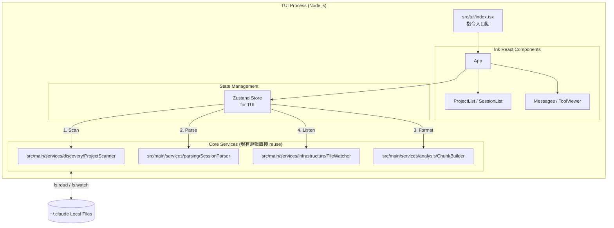

# Claude-DevTools TUI 架構實作指南 (基於 Node.js + Ink)

這份文件詳細規劃了如何沿用 `claude-devtools` 現有的 Node.js 核心邏輯（解析、掃描、監聽），透過 **[Ink](https://github.com/vadimdemedes/ink)** 框架，以**改動最少**的方式實作一個 Terminal User Interface (TUI)。

---

## 1. 架構全景 (Architecture Overview)

 TUI 將作為一個全新的「進入點 (Entry Point)」存在，完全繞過 Electron 的 Main/Preload/Renderer 架構，直接調用 `src/main/services` 的核心業務邏輯。



## 2. 目錄結構規劃 (Directory Structure)

在 `src/` 底下新增一個 `tui/` 目錄。這會與現有的 `main/`, `renderer/`, `shared/` 平行。

```text
src/
├── main/       # (保持不變)
├── preload/    # (保持不變)
├── renderer/   # (保持不變)
├── shared/     # (保持不變)
└── tui/        # [新增] TUI 專屬目錄
    ├── index.tsx           # TUI 應用啟動入口 (render App)
    ├── store.ts            # TUI 專屬的狀態管理 (Zustand)
    ├── components/         # Ink UI 元件
    │   ├── App.tsx         # 根元件，處理佈局 (Flex row/col)
    │   ├── Sidebar.tsx     # 左側選單：專案與會話列表
    │   ├── ChatView.tsx    # 右側主畫面：對話紀錄瀑布流
    │   └── ui/             # 共用或基礎的視覺元件
    │       ├── Select.tsx  # 上下鍵選擇清單 (基於 ink-select-input)
    │       └── Box.tsx     # 封裝帶有邊框的 Box
    └── hooks/
        └── useKeyPress.ts  # 封裝鍵盤事件監聽
```

## 3. 核心技術選型 (Tech Stack Details)

1. **核心框架**:
   - `ink`: 提供基於 React 的終端機 UI 渲染能力。
   - `react`: TUI 的元件一樣使用 React 來編寫。
2. **UI 互動與版面**:
   - `ink-select-input`: 用於處理由上到下的清單選單（例如專案列表、對話列表）。
   - `ink-text-input`: 若需要搜尋或文字輸入功能時使用。
3. **狀態管理**:
   - `zustand`: 現有網頁端已熟悉，TUI 可以自己建一個簡單的 Store 來放當前選中的 Project ID、Session ID 與 Parse 回來的資料。
4. **編譯打包**:
   - 在 `package.json` 加入一套新的腳本，透過 `esbuild` 或使用 `tsx` 直接執行 `src/tui/index.tsx`。

## 4. 實作步驟指引 (Implementation Steps)

### Step 1: 建立 TUI 專屬 Zustand Store (`src/tui/store.ts`)

這個 Store 的目的是「橋接」Node.js 核心服務與 Ink UI。

```typescript
import { create } from 'zustand';
import { ProjectScanner } from '../main/services/discovery/ProjectScanner';
import { SessionParser } from '../main/services/parsing/SessionParser';
import { ChunkBuilder } from '../main/services/analysis/ChunkBuilder';
import { FileWatcher } from '../main/services/infrastructure/FileWatcher';
// 重用 shared 的型別
import type { Project, SessionLight, Chunk } from '../shared/types';

interface TuiState {
  projects: Project[];
  sessions: SessionLight[];
  activeProjectId: string | null;
  activeSessionId: string | null;
  chunks: Chunk[];
  
  loadProjects: () => Promise<void>;
  selectProject: (projectId: string) => Promise<void>;
  selectSession: (sessionId: string) => Promise<void>;
}

export const useTuiStore = create<TuiState>((set, get) => ({
  projects: [],
  sessions: [],
  activeProjectId: null,
  activeSessionId: null,
  chunks: [],

  loadProjects: async () => {
    // 直接呼叫 main 層的邏輯！
    const scanner = new ProjectScanner();
    const projects = await scanner.scanProjects();
    set({ projects });
  },

  selectProject: async (projectId) => {
    const scanner = new ProjectScanner();
    const sessions = await scanner.scanSessions(projectId);
    set({ activeProjectId: projectId, sessions });
  },

  selectSession: async (sessionId) => {
    const { activeProjectId } = get();
    if (!activeProjectId) return;
    
    // 這裡同樣直接調用解析器與轉換器
    const parser = new SessionParser();
    const data = await parser.parseSession(activeProjectId, sessionId);
    
    const chunker = new ChunkBuilder();
    const chunks = chunker.buildChunks(data.messages);
    
    set({ activeSessionId: sessionId, chunks });
  }
}));
```

### Step 2: 建立 Ink 基本版面佈局 (`src/tui/components/App.tsx`)

使用 Ink 的 `<Box>` 元件來取代網頁的 `<div>`，它預設就是 Flexbox。

```tsx
import React, { useEffect } from 'react';
import { Box, Text } from 'ink';
import { useTuiStore } from '../store';
import { Sidebar } from './Sidebar';
import { ChatView } from './ChatView';

export const App = () => {
  const loadProjects = useTuiStore(s => s.loadProjects);

  useEffect(() => {
    loadProjects();
  }, []);

  return (
    <Box flexDirection="column" width="100%" height="100%">
      {/* 頂部標題列 */}
      <Box borderStyle="single" borderColor="cyan" paddingX={1}>
        <Text bold color="cyan">Claude DevTools TUI</Text>
      </Box>

      {/* 左右分屏 */}
      <Box flexDirection="row" flexGrow={1}>
        {/* 左側邊欄 (固定寬度) */}
        <Box width={30} borderStyle="single" borderRight={false}>
          <Sidebar />
        </Box>

        {/* 右側主畫面 (自適應寬度) */}
        <Box flexGrow={1} borderStyle="single">
          <ChatView />
        </Box>
      </Box>
    </Box>
  );
};
```

### Step 3: 修改建置腳本 (`package.json`)

為了讓開發者可以輕易啟動 TUI，我們不需要經過 Electron 打包。直接運用 `vite-node` 或 `tsx` 來執行 TypeScript。

```json
{
  "scripts": {
    "tui": "tsx src/tui/index.tsx",
    "tui:build": "esbuild src/tui/index.tsx --bundle --platform=node --target=node18 --outfile=dist/tui.js"
  }
}
```

## 5. 難點與注意事項 (Challenges & Gotchas)

選擇「選項一」雖然改動最小，但仍有幾個需克服的 TUI 開發痛點：

1. **圖表渲染能力受限**：
   原本地的 `Renderer` 有圓餅圖、長條圖等。在 Ink 裡面，必須改用純 ASCII 字元 (例如 `████░░░░`) 來模擬長度與百分比。可以寫一個專屬的 `<TokenBar>` 元件來轉換數字為進度條字元。
2. **滾動 (Scrolling) 實作**：
   Ink 原生不支援像是瀏覽器那樣的滑鼠滾輪或溢出隱藏 (`overflow: auto`)。
   實作上聊天區塊的列表如果太長，必須使用第三方的 `ink-virtual-list` 或是自己紀錄 `offset`，透過鍵盤上下鍵來裁切顯示的 Array 片段。
3. **即時監聽 (FileWatcher) 的結合**：
   前端 React 有 `useEffect` 接收 IPC 廣播，在 TUI Store 裡，當觸發 `selectSession` 時，要在 Store 內部啟動 `main` 的 `FileWatcher`，並綁定一個 callback 讓 Store 更新資料，以實現終端機畫面的即時刷新。

---

整體而言，這個方案將完全 **零侵入** 地保留您現有的核心解析邏輯，只需要新增大約 5~10 個 Ink 的 React 元件檔以及一份獨立的 Store 就能讓 TUI 順利跑起來。
